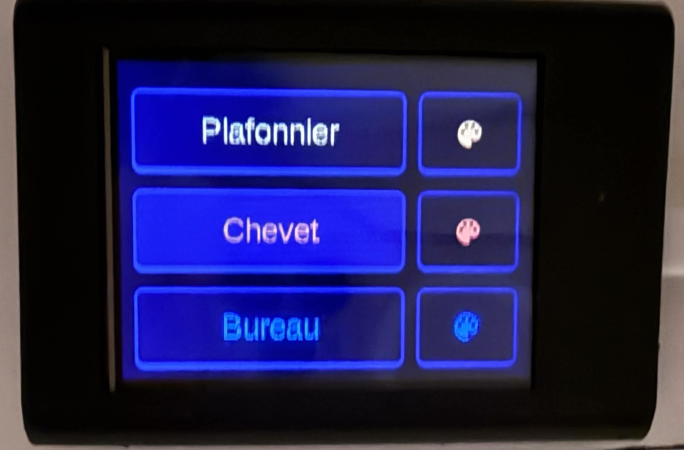
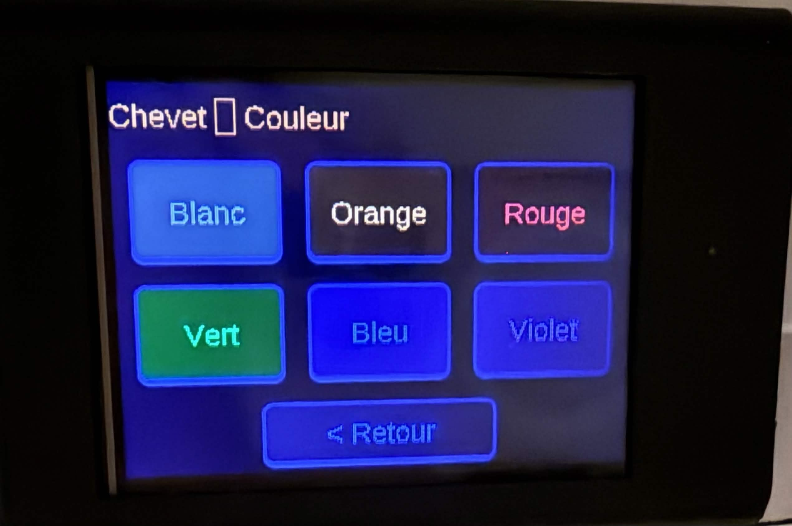

# CYD-Buttons-HA

Télécommande tactile pour Home Assistant sur écran **ESP32 Cheap Yellow
Display (CYD) 2.8"**, via [ESPHome](https://esphome.io) et LVGL. Trois
lumières pilotées : allumer/éteindre en un tap, choisir une couleur en deux.




## Fonctionnalités

- Page principale : un bouton *toggle* par lumière (Plafonnier, Chevet, Bureau)
  et un bouton palette qui ouvre la sous-page couleur correspondante.
- Sous-pages couleur : Blanc, Orange, Rouge, Vert, Bleu, Violet, plus un
  bouton « < Retour ».
- Les boutons *toggle* reflètent l'état réel de la lumière dans Home
  Assistant (allumé = coché), pas seulement l'état demandé localement.
- Flash initial en USB, mises à jour suivantes en OTA (Wi-Fi).

## Structure du dépôt

```text
CYD-Buttons-HA/
├── esphome.yaml           # Config principale (display, LVGL, pages, API)
├── scripts.yaml           # Scripts Home Assistant (une couleur par script)
├── secrets.example.yaml   # Gabarit à copier en secrets.yaml (non commité)
├── fonts/
│   ├── Arimo-Regular.ttf
│   └── materialdesignicons-webfont.ttf
└── docs/images/           # Captures de l'interface
```

## Prérequis

- Un écran ESP32 CYD 2.8" (ILI9xxx / ST7789V, tactile XPT2046)
- Une instance Home Assistant, avec l'API ESPHome activée
- **ESPHome 2024.11.0** — figé volontairement, voir [Pièges connus](#pièges-connus)
- **Python 3.12.x** — pas 3.13 ni 3.14 (incompatibilité avec cette version d'ESPHome)

## Installation

1. Copier `secrets.example.yaml` en `secrets.yaml` et renseigner les
   identifiants (Wi-Fi, clé API ESPHome, mot de passe OTA).
2. Adapter dans `esphome.yaml` et `scripts.yaml` les `entity_id` des
   lumières (`light.plafonier_mathyou`, etc.) à ton installation Home Assistant.
3. Créer et activer un environnement Python 3.12 dédié :

   ```bash
   py -3.12 -m venv venv_esphome
   venv_esphome\Scripts\activate
   pip install esphome==2024.11.0
   ```

4. Flasher en USB (premier flash uniquement) :

   ```bash
   esphome run esphome.yaml
   ```

5. Les mises à jour suivantes peuvent se faire en OTA, une fois l'ESP32 sur le Wi-Fi :

   ```bash
   esphome run esphome.yaml --device <IP_DE_L_ESP32>
   esphome logs esphome.yaml --device <IP_DE_L_ESP32>
   ```

## Pièges connus

Retenus après plusieurs sessions de débogage sur cette combinaison
ESPHome/LVGL/écran — à ne pas reproduire :

- `color_palette: 8BIT` n'existe pas en ESPHome 2024.11.0 : le firmware plante au démarrage.
- `auto_clear_enabled: false` est obligatoire dans le bloc `display` avec LVGL,
  sinon erreur au démarrage.
- `invert_colors: false` doit rester à `false` pour ce modèle d'écran (ST7789V).
- Ne pas ajouter `color_order: rgb` : ça rend l'écran entièrement blanc.
- Utiliser la syntaxe `homeassistant.service` (pas `homeassistant.action`,
  réservée aux versions 2025+ d'ESPHome).

### Si l'écran reste blanc

1. Vérifier la version d'ESPHome (`== 2024.11.0`).
2. Vérifier la présence de `auto_clear_enabled: false` dans `display`.
3. Vérifier l'absence de `color_palette` dans `display`.
4. Vérifier que Python 3.12 est utilisé (`python --version`).
5. Vérifier que Pillow est installé (`pip show pillow`).

### Si le port série est occupé

Fermer Arduino IDE / PlatformIO / un terminal série ouvert, débrancher puis
rebrancher l'ESP32, ou basculer directement sur l'OTA (voir plus haut).

## Licence

MIT — voir [LICENSE](LICENSE).
